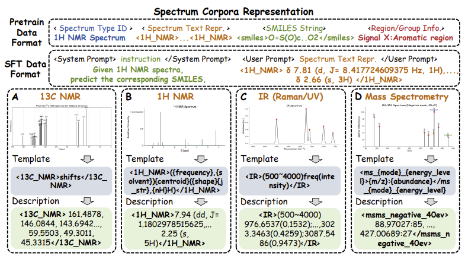
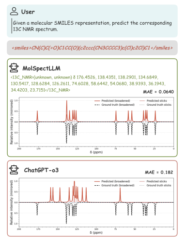
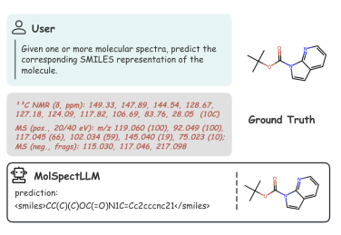
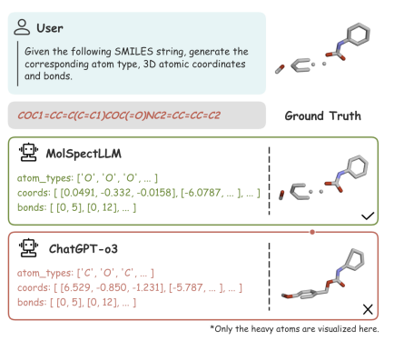
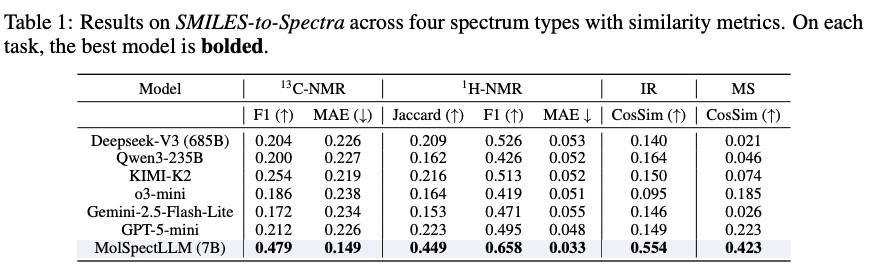

# MolSpectLLM

> Bridging spectroscopy, molecular elucidation, and 3D generation with a unified foundation model.



MolSpectLLM pairs large-language-model reasoning with rich physicochemical signals. By training on paired spectra, SMILES, and structural data, the model navigates from raw experimental evidence to validated molecular proposals and 3D conformers. This repository contains code, benchmarks, and assets accompanying the paper:

**MolSpectLLM: A Molecular Foundation Model Bridging Spectroscopy, Molecule Elucidation, and 3D Structure Generation**  
Shuaike Shen, Jiaqing Xie, Zhuo Yang, Antong Zhang, Shuzhou Sun, Ben Gao, Tianfan Fu, Biqing Qi, Yuqiang Li  
arXiv: [2509.21861](https://arxiv.org/abs/2509.21861)

---

## 🔥 Why MolSpectLLM?

- **Tri-modal fusion** – integrates NMR, IR, and MS spectra alongside SMILES and 3D coordinates to reason about stereochemistry and conformations.
- **State-of-the-art spectra reasoning** – achieves 0.53 average accuracy across spectrum tasks and 15.5% sequence accuracy on Spectra-to-SMILES, outperforming general-purpose LLMs.
- **Structure-aware generation** – infers chemically plausible 3D structures directly from spectral or SMILES prompts, enabling seamless loops from measurement to molecule.
- **Extensible tooling** – evaluation scripts and metrics for spectra, molecules, and 3D reconstructions are included under `metrics/` and `scripts/`.

---

## 🧠 Model Capabilities

| Spectral Analysis | Molecule Elucidation | 3D Generation |
| --- | --- | --- |
|  |  |  |

- **Spectrum-to-SMILES reasoning**: translates multi-modal spectral evidence into candidate structures with token-level explanations.
- **Chemically grounded chat**: answers molecule QA tasks, validates hypotheses, and reasons about reactions.
- **Conformer synthesis**: outputs high-fidelity 3D geometries that respect stereochemical constraints.

### Benchmark Snapshot



MolSpectLLM outperforms language-only baselines across all benchmark tasks, particularly when spectra must be reconciled with structural priors.

---

## 📊 Evaluation Toolkit

- **Spectra metrics**: `metrics/spectrum/` provides cosine similarity, precision/recall matching, and cross-modal analyses for IR, MS, and NMR benchmarks.
- **Molecule QA**: `metrics/molecule/` evaluates multiple-choice and sequence generation accuracy for naming tasks.
- **3D validation**: `metrics/3d_gen/` quantifies fingerprint similarity, clash counts, and geometry sanity checks for SMILES-to-structure pipelines.
- **Formatting utilities**: `scripts/` contains data standardisation helpers to convert raw numerical peaks into description-rich text and vice versa.

Each module exposes a CLI; run with `--help` for arguments and file formats.

---

## 🗺️ Repository Layout

```
MolSpectLLM/
├── metrics/         # Evaluation scripts for spectra, molecules, and 3D metrics
├── scripts/         # Spectral/NMR formatting and analysis utilities
├── examples/        # data examples
└── images/          # Figures used in the README and paper
```

---

## 📣 Citation

If you find MolSpectLLM useful, please cite our work:

```bibtex
@misc{shen2025molspectllmmolecularfoundationmodel,
      title={MolSpectLLM: A Molecular Foundation Model Bridging Spectroscopy, Molecule Elucidation, and 3D Structure Generation},
      author={Shuaike Shen and Jiaqing Xie and Zhuo Yang and Antong Zhang and Shuzhou Sun and Ben Gao and Tianfan Fu and Biqing Qi and Yuqiang Li},
      year={2025},
      eprint={2509.21861},
      archivePrefix={arXiv},
      primaryClass={cs.LG},
      url={https://arxiv.org/abs/2509.21861}
}
```

---

## 🤝 Contributing

Issues, feature requests, and pull requests are welcome. Please open a discussion if you plan to extend MolSpectLLM to new spectral modalities or benchmarks.

Embark on the spectra-to-structure journey with MolSpectLLM! 🚀

